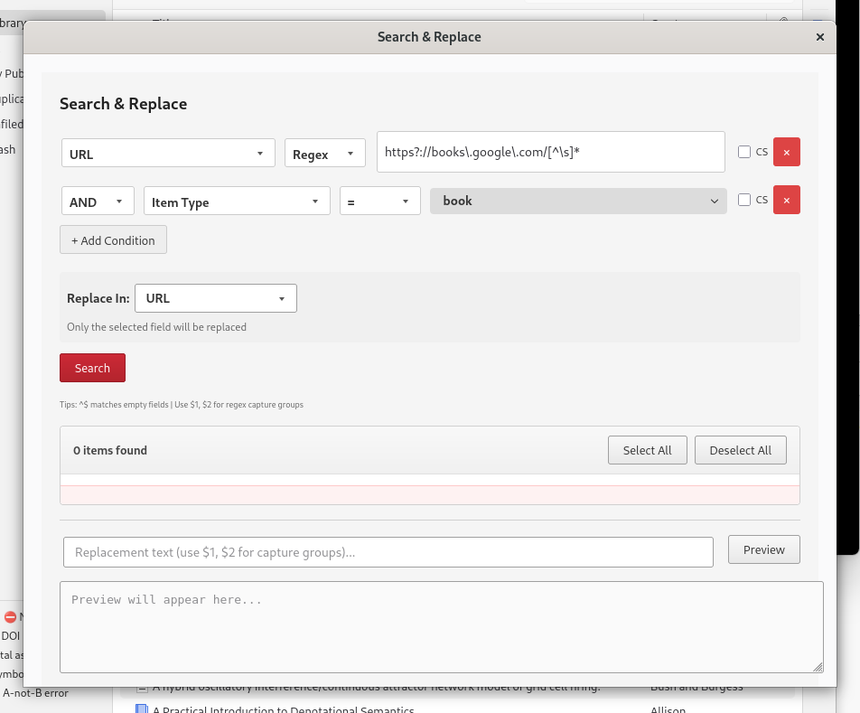

# Zotero Search & Replace

Advanced search and replace functionality for Zotero bibliographic items.

## Features



- **Search**: Search across multiple fields (title, creators, abstract, tags, DOI, etc.)
- **Pattern Types**: Regular expressions, exact match, or SQL LIKE patterns
- **Replace**: Batch replace with capture group support ($1, $2, etc.)
- **Preloaded Patterns**: 18 data quality patterns for common bibliographic errors
- **Preview**: Preview replacements before applying
- **Collections**: Create collections from search results
- **Collection Scope**: Automatically scopes searches to the currently selected collection in Zotero's main window (when a collection is selected)

## Installation

1. Download the latest `.xpi` file from the [releases page](../../releases)
2. In Zotero, go to **Tools → Add-ons**
3. Click the gear icon → **Install Add-on From File**
4. Select the downloaded `.xpi` file
5. Restart Zotero

## Usage

1. Open the dialog via **Edit → Search & Replace...** or **Tools → Search & Replace...**
2. Select the field(s) to search in
3. Choose the pattern type (Regex, Exact, or SQL LIKE)
4. Enter your search pattern and (optionally) replacement text
5. Click **Search** to find matching items
6. Select items to replace, preview changes, and click **Replace in Selected**

### Collection Scope

When a collection is selected in Zotero's main window, the Search & Replace dialog automatically scopes searches to that collection. This is useful when:

- Working with group libraries where different groups may have different naming conventions
- Targeting specific projects within your library
- Batch editing items in a focused collection

To use: simply select a collection in Zotero's left sidebar before opening Search & Replace. The search will automatically be limited to items in that collection. If you want to search the entire library, select "My Library" (or the library root) instead of a specific collection.

### Preloaded Patterns

The plugin includes 18 preloaded data quality patterns for common bibliographic errors:

- **Author Names**: Fix comma spacing, lowercase "van/de/etc.", Jr./Sr. suffixes
- **Dates**: Standardize date formats, fix month names
- **Titles**: Capitalization fixes, remove extra spaces
- **URLs/DOI**: Fix URL protocols, standardize DOI format, remove spurious Google Books URLs for printed books
- **Publications**: Clean up conference names, journal abbreviations

## Development

### Setup

```bash
npm install
```

### Build

```bash
npm run build
```

### Test

```bash
npm run test:zotero
```

## License

GPL-3.0 - See LICENSE file for details.

## Author

Marcin Miłkowski
